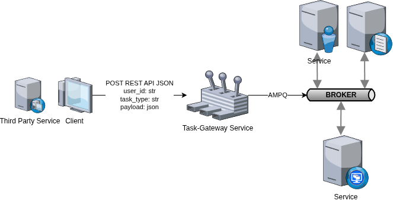

# Task Gateway

> Rust + Axum + lapin service

Task Gateway is a small HTTP API service that works as a task bus between clients and downstream processing services.


The service accepts task requests through HTTP, assigns a task id, serializes the request as a broker message, and publishes it to RabbitMQ. Downstream services consume messages from their own queues and process the task asynchronously.

A successful response from Task Gateway means that the task was accepted by the bus and published to RabbitMQ. It does not mean that the downstream service has completed the task.

## Current Integrations

Task Gateway is currently connected to RabbitMQ and routes tasks to these downstream service domains:

| Service domain | Service name in task key | Exchange | Queue | Task types |
| --- | --- | --- | --- | --- |
| Image generation | `image-generation` | `images.tasks` | `images.queue` | `images.generate`, `images.edit` |
| Video generation | `video-generation` | `videos.tasks` | `videos.queue` | `videos.generate`, `videos.animate` |

The public HTTP endpoint is:

```http
POST /api/v1/broker/publish
Content-Type: application/json
```

Example request:

```json
{
  "user_id": "12345",
  "task_type": "images.generate",
  "payload": {
    "model": "openrouter::google/gemini-3.1-flash-image-preview",
    "prompt": "post-apocalyptic warrior standing in a ruined city",
    "image_name": "warrior"
  }
}
```

Example response:

```json
{
  "task_key": "12345:image-generation:550e8400-e29b-41d4-a716-446655440000"
}
```

The `task_key` format is:

```text
user_id:service_name:task_uuid
```

Clients should store this key if they need to track the task in downstream APIs.

## RabbitMQ Topology

RabbitMQ topology is configured on the broker side, not by Task Gateway.

Task Gateway does not create queues, exchanges, or bindings. The service only checks that the selected exchange already exists and publishes a message to it. In code this is done with passive exchange declaration before publishing.

For Docker Compose, the broker topology is loaded from:

```text
docker-compose/rabbitmq/definitions.json
```

RabbitMQ is configured to load that file through:

```text
docker-compose/rabbitmq/rabbitmq.conf
```

Current broker configuration includes:

- exchanges: `images.tasks`, `videos.tasks`
- queues: `images.queue`, `videos.queue`
- bindings:
  - `images.tasks` -> `images.queue` with `images.generate`
  - `images.tasks` -> `images.queue` with `images.edit`
  - `videos.tasks` -> `videos.queue` with `videos.generate`
  - `videos.tasks` -> `videos.queue` with `videos.animate`

If a task type points to an exchange or routing key that is not configured in RabbitMQ, publishing will fail. With `mandatory: true`, unroutable messages are returned by RabbitMQ and Task Gateway converts that into an error.

## Service Configuration

Task Gateway only needs the RabbitMQ connection address and the HTTP server address.

Default local configuration is stored in:

```text
config/development.toml
```

Docker Compose environment values are stored in:

```text
docker-compose/.env.task-gateway
```

Important variables:

```env
TASK_GATEWAY__RUN_MODE=development
TASK_GATEWAY__SERVER__ADDRESS=0.0.0.0:10010
TASK_GATEWAY__BROKER__ADDRESS=amqp://rabbitmq:5672
```

The broker topology itself must still be configured in RabbitMQ definitions. Do not add queues, bindings, routing keys, or exchange declarations to Task Gateway configuration.

## Adding a New Task Type

To add a new task type for an existing service domain, update both Task Gateway code and RabbitMQ definitions.

Example: add `images.upscale` to the existing image service.

1. Add the task type to `TaskType` in `src/modules/broker/models/mod.rs`:

```rust
#[serde(rename = "images.upscale")]
ImagesUpscale,
```

2. Return the public routing key in `impl ToString for TaskType`:

```rust
Self::ImagesUpscale => "images.upscale".into(),
```

3. Map the task type to the correct exchange in `TaskType::exchange()`:

```rust
Self::ImageGenerate | Self::ImageEdit | Self::ImagesUpscale => {
    ServiceExchange::ImagesExchange
}
```

4. Add a RabbitMQ binding in `docker-compose/rabbitmq/definitions.json`:

```json
{
  "source": "images.tasks",
  "vhost": "/",
  "destination": "images.queue",
  "destination_type": "queue",
  "routing_key": "images.upscale",
  "arguments": {}
}
```

5. Update API documentation and tests so the new task type is visible to clients.

## Adding a New Exchange and Service Domain

To connect a new downstream service domain, add routing support in code and create the RabbitMQ topology on the broker side.

Example: add an audio service with `audio.generate`.

1. Add task type variants in `src/modules/broker/models/mod.rs`:

```rust
#[serde(rename = "audio.generate")]
AudioGenerate,
```

2. Add a service exchange:

```rust
#[serde(rename = "audio.tasks")]
AudioExchange,
```

3. Map the task type to the exchange:

```rust
Self::AudioGenerate => ServiceExchange::AudioExchange,
```

4. Add the exchange name:

```rust
Self::AudioExchange => "audio.tasks".to_string(),
```

5. Add the service name used in `task_key`:

```rust
Self::AudioExchange => "audio-generation".to_owned(),
```

6. Configure RabbitMQ in `docker-compose/rabbitmq/definitions.json`:

```json
{
  "name": "audio.queue",
  "vhost": "/",
  "durable": true,
  "auto_delete": false,
  "arguments": {
    "x-queue-type": "classic"
  }
}
```

```json
{
  "name": "audio.tasks",
  "vhost": "/",
  "type": "direct",
  "durable": true,
  "auto_delete": false,
  "internal": false,
  "arguments": {}
}
```

```json
{
  "source": "audio.tasks",
  "vhost": "/",
  "destination": "audio.queue",
  "destination_type": "queue",
  "routing_key": "audio.generate",
  "arguments": {}
}
```

7. Make sure the new downstream service consumes from `audio.queue`.

8. Update Swagger descriptions and tests.

## Message Publishing Behavior

Task Gateway publishes messages with:

- direct exchange routing
- routing key equal to `task_type`
- persistent delivery mode
- publisher confirms enabled
- `mandatory: true`

The message body is a serialized `PublishMessage`:

```json
{
  "task_id": "550e8400-e29b-41d4-a716-446655440000",
  "user_id": "12345",
  "task_type": "images.generate",
  "payload": {
    "prompt": "Generate an image"
  }
}
```

The `payload` object is service-specific. Task Gateway does not validate or transform it; it forwards the object to the selected downstream service.

## Local Development

Run tests:

```bash
cargo test
```

Run the service locally:

```bash
cargo run --bin run_server
```

Run through Docker Compose:

```bash
cd docker-compose
docker compose up
```

Swagger UI is available at:

```text
/docs
```
