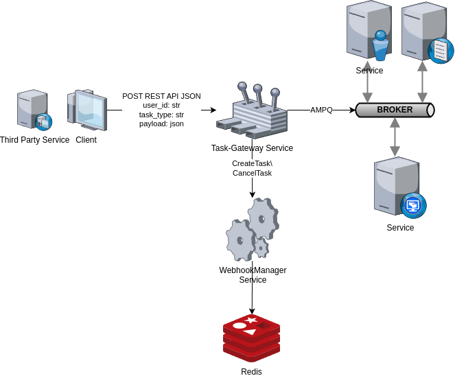

# Task Gateway

> Rust + Axum + lapin service

Task Gateway is a small HTTP API service that works as a task bus between
clients and downstream processing services.


The service accepts task requests through HTTP, assigns a task id, publishes the
request to RabbitMQ, and registers the initial task state through the configured
state manager. Downstream services consume messages from their own queues and
process the task asynchronously.

A successful publish response means that the task was published to RabbitMQ and
registered in the state manager. It does not mean that the downstream service
has completed the task.

## Current Integrations

Task Gateway is connected to RabbitMQ for task delivery and to a webhook-based
state manager for task creation and cancellation. It routes tasks to these
downstream service domains:

| Service domain | Service name in task key | Exchange | Queue | Task types |
| --- | --- | --- | --- | --- |
| Image generation | `image-generation` | `images.tasks` | `images.queue` | `images.generate`, `images.edit` |
| Video generation | `video-generation` | `videos.tasks` | `videos.queue` | `videos.generate`, `videos.animate` |

The public HTTP endpoints are:

```http
POST /api/v1/broker/publish
POST /api/v1/tasks/cancel?task_id={task_key}
```

### Publish a task

```http
POST /api/v1/broker/publish
Content-Type: application/json
```

Example request:

```json
{
  "user_id": "12345",
  "task_type": "images.generate",
  "payload": {
    "model": "openrouter::google/gemini-3.1-flash-image-preview",
    "prompt": "post-apocalyptic warrior standing in a ruined city",
    "image_name": "warrior"
  }
}
```

Example response:

```json
{
  "task_key": "12345:image-generation:550e8400-e29b-41d4-a716-446655440000"
}
```

The `task_key` format is:

```text
user_id:service_name:task_uuid
```

Clients should store this key if they need to track the task in downstream APIs.

### Cancel a task

Pass the `task_key` returned by the publish endpoint as the `task_id` query
parameter:

```http
POST /api/v1/tasks/cancel?task_id=12345:image-generation:550e8400-e29b-41d4-a716-446655440000
```

Successful response:

```json
{
  "code": 200,
  "message": "ok"
}
```

The endpoint passes `task_id` to the configured state manager. The webhook
implementation updates the task progress to `CANCELLED` with progress `0.0`.

## Task State Management

After RabbitMQ accepts a message, Task Gateway extracts `service_name` from the
returned `task_key`, serializes the original request payload into
`response_data`, builds a pending `TaskState`, and submits it to the state
manager.

The publish operation is performed before state registration. If publishing
succeeds but the state manager call fails, the API returns the state manager
error even though the broker message has already been accepted.

## RabbitMQ Topology

RabbitMQ topology is configured on the broker side, not by Task Gateway.

Task Gateway does not create queues, exchanges, or bindings. The service only checks that the selected exchange already exists and publishes a message to it. In code this is done with passive exchange declaration before publishing.

For Docker Compose, the broker topology is loaded from:

```text
docker-compose/rabbitmq/definitions.json
```

RabbitMQ is configured to load that file through:

```text
docker-compose/rabbitmq/rabbitmq.conf
```

Current broker configuration includes:

- exchanges: `images.tasks`, `videos.tasks`
- queues: `images.queue`, `videos.queue`
- bindings:
  - `images.tasks` -> `images.queue` with `images.generate`
  - `images.tasks` -> `images.queue` with `images.edit`
  - `videos.tasks` -> `videos.queue` with `videos.generate`
  - `videos.tasks` -> `videos.queue` with `videos.animate`

If a task type points to an exchange or routing key that is not configured in RabbitMQ, publishing will fail. With `mandatory: true`, unroutable messages are returned by RabbitMQ and Task Gateway converts that into an error.

## Service Configuration

Task Gateway configuration contains the HTTP server address, RabbitMQ
connection address, state manager endpoints, and the task routing table.

Default local configuration is stored in:

```text
config/development.toml
```

Docker Compose environment values are stored in:

```text
docker-compose/.env.task-gateway
```

Important variables:

```env
TASK_GATEWAY__RUN_MODE=development
TASK_GATEWAY__SERVER__ADDRESS=0.0.0.0:10010
TASK_GATEWAY__BROKER__ADDRESS=amqp://rabbitmq:5672
TASK_GATEWAY__STATE_MANAGER__ADDRESS=http://webhook-manager:10001
TASK_GATEWAY__STATE_MANAGER__CREATE_TASK_ENDPOINT=/api/v2/storage/task
TASK_GATEWAY__STATE_MANAGER__UPDATE_PROGRESS_ENDPOINT=/api/v1/storage/update_progress
```

`TASK_GATEWAY__STATE_MANAGER__CREATE_TASK_ENDPOINT` is used to register newly
published tasks. `TASK_GATEWAY__STATE_MANAGER__UPDATE_PROGRESS_ENDPOINT` is
used by the cancel endpoint to set the task state to `CANCELLED`.

The Docker environment expects the state manager to be reachable as
`webhook-manager:10001`. Override `TASK_GATEWAY__STATE_MANAGER__ADDRESS` when
the service uses a different host or port.

Routes are defined in TOML because arrays of route tables are easier to maintain
there than through environment variables:

```toml
[[broker.routes]]
task_type = "images.generate"
exchange = "images.tasks"
service_name = "image-generation"
```

`task_type` is also used as the RabbitMQ routing key. `service_name` becomes the
middle segment of the returned `task_key` and therefore must not contain `:`.
Duplicate task types and empty route fields cause startup to fail.

Queues, exchanges, and bindings are still owned by RabbitMQ and configured in
`docker-compose/rabbitmq/definitions.json`. They are not created by Task Gateway.

## Adding a New Task Type

To add a new task type for an existing service domain, update the Task Gateway
configuration and RabbitMQ definitions. Recompiling Task Gateway is not required.

Example: add `images.upscale` to the existing image service.

1. Add the route to `config/development.toml` or the active run-mode file:

```toml
[[broker.routes]]
task_type = "images.upscale"
exchange = "images.tasks"
service_name = "image-generation"
```

2. Add a RabbitMQ binding in `docker-compose/rabbitmq/definitions.json`:

```json
{
  "source": "images.tasks",
  "vhost": "/",
  "destination": "images.queue",
  "destination_type": "queue",
  "routing_key": "images.upscale",
  "arguments": {}
}
```

3. Update API documentation and tests so the new task type is visible to clients.

## Adding a New Exchange and Service Domain

To connect a new downstream service domain, add a Task Gateway route and create
the RabbitMQ topology on the broker side.

Example: add an audio service with `audio.generate`.

1. Add the route to the active Task Gateway configuration:

```toml
[[broker.routes]]
task_type = "audio.generate"
exchange = "audio.tasks"
service_name = "audio-generation"
```

2. Configure RabbitMQ in `docker-compose/rabbitmq/definitions.json`:

```json
{
  "name": "audio.queue",
  "vhost": "/",
  "durable": true,
  "auto_delete": false,
  "arguments": {
    "x-queue-type": "classic"
  }
}
```

```json
{
  "name": "audio.tasks",
  "vhost": "/",
  "type": "direct",
  "durable": true,
  "auto_delete": false,
  "internal": false,
  "arguments": {}
}
```

```json
{
  "source": "audio.tasks",
  "vhost": "/",
  "destination": "audio.queue",
  "destination_type": "queue",
  "routing_key": "audio.generate",
  "arguments": {}
}
```

3. Make sure the new downstream service consumes from `audio.queue`.

4. Update Swagger descriptions and tests.

## Message Publishing Behavior

Task Gateway publishes messages with:

- direct exchange routing
- routing key equal to `task_type`
- persistent delivery mode
- publisher confirms enabled
- `mandatory: true`

The message body is a serialized `PublishMessage`:

```json
{
  "task_id": "550e8400-e29b-41d4-a716-446655440000",
  "user_id": "12345",
  "task_type": "images.generate",
  "payload": {
    "prompt": "Generate an image"
  }
}
```

The `payload` object is service-specific. Task Gateway forwards it unchanged to
the selected downstream service. The same object is serialized as a JSON string
when it is stored in `TaskState.response_data`.

## Local Development

Run tests:

```bash
cargo test
```

Run the service locally:

```bash
cargo run --bin run_server
```

Run through Docker Compose:

```bash
cd docker-compose
docker compose up
```

Swagger UI is available at:

```text
/docs
```
